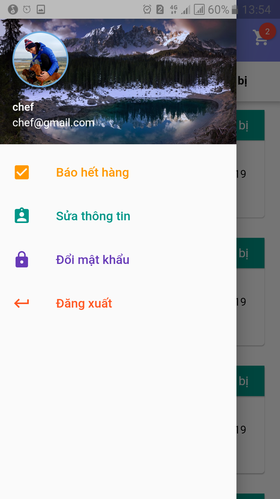

# Resman Mobile Staff

Cross Platform Mobile application for **Staff** of Restaurant Management project

# Usage

### Clone

`git clone git@github.com:restaurant-management/resman-mobile-staff.git`
`cd resman-mobile-staff`

### Get package

`flutter pub get`

### Add your google-sevices.json to android/app/

### Apply launcher icon

`flutter pub run flutter_launcher_icons:main`

### Run

`flutter run`

# Screens

## Screens for staff 

## Screens for chef

# Contributors
Thanks for all contributors ([emoji key](https://allcontributors.org/docs/en/emoji-key)): 

<!-- Contributors table START -->
| [ Hieren Lee](https://github.com/hienlh) [✅](https://github.com/restaurant-management/resman-mobile-customer/blob/master/README.md "Tutorials") [🚇](https://github.com/restaurant-management/resman-mobile-customer/commits?author=hienlh "Infrastructure (Hosting, CI-CD, etc)") [🎨](# "Design") [👀](https://github.com/restaurant-management/resman-mobile-customer/pulls?q=is%3Apr+reviewed-by%3Ahienlh "Reviewed Pull Requests") | [ Phan Thanh Duy](https://github.com/ThanhDuyPhan) [💻](https://github.com/restaurant-management/resman-mobile-customer/commits?author=ThanhDuyPhan "Code") [🎨](# "Design") |
| :---: | :---: |
<!-- Contributors table END -->

This project follows the [all-contributors](https://allcontributors.org) specification.
Contributions of any kind are welcome!